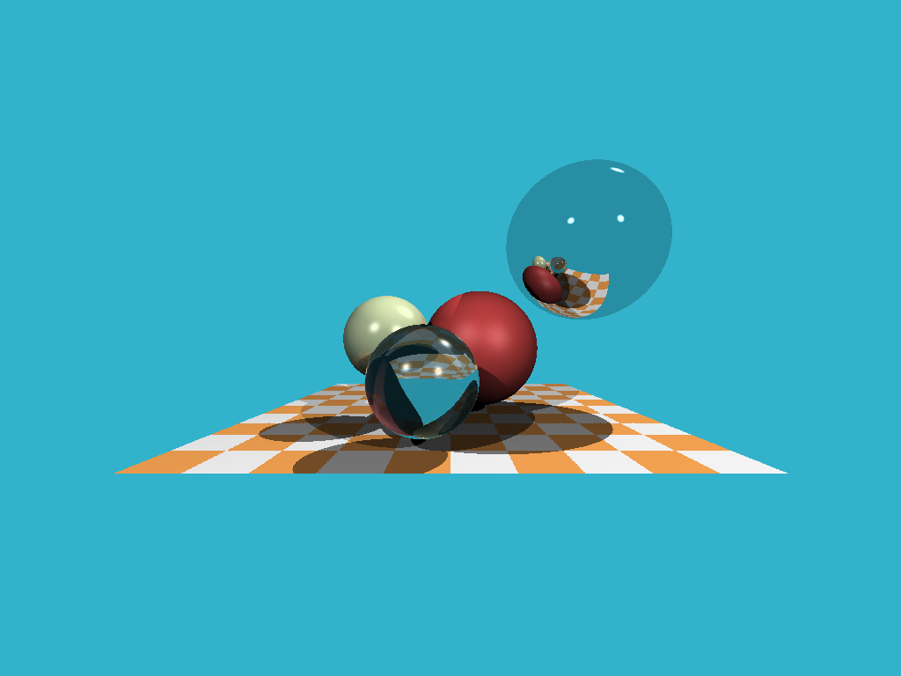
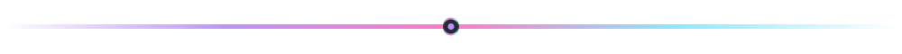

<div align="center">
  
</div>

<div align="center">
  <a href="https://github.com/kads1024">
    
  </a>
</div>

<div align="center">
  
  
  
</div>

---

## 👋 About Me

I'm a software engineer who builds **real-time, performance-sensitive systems**. Games are where I started to sharpened that skill set (tight frame budgets, cache-friendly data layouts, and manual memory management leave very little room to be sloppy), but the engineering underneath travels well beyond them.

I work primarily in **C++** and **C#**, across **Unity**, **Unreal Engine**, and hand-rolled codebases. I care about clean architecture, readable code that survives contact with a team, and profiling before optimizing.

```cpp
struct Engineer {
    std::string name     = "Kenneth";
    std::string role     = "Software Engineer";
    std::string location = "Philippines";

    std::vector<std::string> core      = { "C++", "C#", ".NET" };
    std::vector<std::string> engines   = { "Unity", "Unreal Engine" };
    std::vector<std::string> interests = { "Systems Design", "Graphics", "Tooling", "Optimization" };

    bool open_to_work() const noexcept { return true; }
};
```

### 🚀 Currently

- 🔭 Building &nbsp;→&nbsp; an unannounced title under NDA: real-time multiplayer systems work
- 🌱 Learning &nbsp;→&nbsp; graphics programming, multithreaded systems, engine internals, and advanced gameplay networking
- 🎯 Looking for &nbsp;→&nbsp; **gameplay, engine, tools, or software engineering roles** (remote-friendly)
- 💬 Ask me about &nbsp;→&nbsp; ECS, gameplay architecture, editor tooling, or shipping under a frame budget

---

## 🎮 Selected Work

<!-- =====================================================================
     TODO — THIS IS THE MOST IMPORTANT SECTION ON THE PAGE.
     A hiring manager decides here. Rules:
       1. Add a GIF for each. Motion beats text every single time.
       2. Lead with the ENGINEERING problem, not the genre or story.
       3. Quantify results wherever you honestly can (ms, MB, FPS, %, players).
       4. Three excellent entries beat six mediocre ones. Delete the rest.
     Put GIFs in assets/projects/ and keep each under ~5MB so they load fast.
     ===================================================================== -->

<table>
<tr>
<td width="50%" valign="top">

### 🔹 [CPU Raytracer (C++20)](https://github.com/kads1024/mini-raytracer)



**Problem**: Understand raytracing well enough to derive it, not just make it compile.<br />
**Built**: ~350-line CPU raytracer in C++20, no third-party libraries, on a templated N-dimensional vector library built with concepts.<br />
**Result**: Diffuse and specular shading, hard shadows, recursive reflection and refraction at 1024×768.<br />
**Notable**: Refraction derived from vector decomposition rather than copied, so total internal reflection emerges from the math instead of being special-cased.

`C++`

<a href="https://github.com/kads1024/mini-raytracer">Code</a> · <a href="https://kads1024.github.io/devlog/building-a-cpu-raytracer-from-scratch-in-c++20"><b>Devlog</b></a>

</td>
<td width="50%" valign="top">

### 🔹 [Procedural Explosion Raymarcher (C++20)](https://github.com/kads1024/mini-raymarcher)


**Problem**: Account for every line of 180 lines of terse C++ written by someone else, the skill tutorials never teach.<br />
**Built**: Sphere-traced SDF renderer reconstructed line by line from ssloy's tinykaboom, on the same templated vector library as the raytracer, with every formula left unevaluated and every constant justified.<br />
**Result**: A procedural explosion at 640×480 with no meshes, no triangles, no acceleration structure. The entire scene is one 11-line distance function shaded from fBm value noise.<br />
**Notable**: My vector library refused to compile the original's "smooth step" line, which turned out to be a dot product in disguise; measuring the fallout showed ~60% of the noise function's interpolation weights clamp out of range, which is exactly what produces its signature texture.

`C++`

<a href="https://github.com/kads1024/mini-raymarcher">Code</a> · <a href="https://kads1024.github.io/devlog/rendering-an-explosion-with-one-function"><b>Devlog</b></a>

</td>
</tr>
<tr>
<td width="50%" valign="top">

### 🔹 [Project Three](https://github.com/kads1024)


**Problem** — the pain point, ideally one a team actually felt
**Built** — the tool, plugin, or library
**Result** — hours saved, bugs prevented, people who used it

`C++` &nbsp;`Unreal Engine` &nbsp;`Editor Tooling`

<a href="https://github.com/kads1024">Code</a> · <a href="#">Docs</a>

</td>
<td width="50%" valign="top">

### 🎨 More Work

Playable builds, jam entries, and prototypes live on itch.io — several are downloadable and take under a minute to try.

<a href="https://kennysans37.itch.io">
  
</a>

<br /><br />

Full case studies with breakdowns of the systems behind each project:

<a href="https://portfolio-wizard-theta.vercel.app/">
  
</a>

</td>
</tr>
</table>

---

## 🛠️ Tech Stack

**Languages**

<p>
  
  
  
  
  
  
  
</p>

**Engines & Frameworks**

<p>
  
  
  
  
  
  
</p>

**Tools & Workflow**

<p>
  
  
  
  
  
  
  
</p>

---

## 🧠 Engineering Focus

| Area | What that means in practice |
|:--|:--|
| **Systems Architecture** | Component/ECS design, decoupled subsystems, data-oriented layouts that scale past the prototype |
| **Performance** | Profile first, then fix: allocation churn, cache misses, draw calls, GC pressure |
| **Gameplay Networking** | Client prediction, server reconciliation, state replication, lag compensation |
| **Tooling** | Custom editors and inspectors, build automation, pipelines that save the team hours |
| **Low-Level C++** | RAII, move semantics, smart pointers, templates — and knowing when *not* to reach for them |
| **Cross-Discipline** | Turning design intent into maintainable systems, shipping alongside artists and designers |

---

## 📊 GitHub Activity

<div align="center">
  
  
</div>

<div align="center">
  
</div>

---

## 🤝 Let's Connect

I'm open to conversations about gameplay, engine, tools, and backend roles — and I answer every message.

<div align="center">
  <a href="https://www.linkedin.com/in/ken-santos/">
    
  </a>
  <a href="https://portfolio-wizard-theta.vercel.app/">
    
  </a>
  <a href="https://kennysans37.itch.io">
    
  </a>
  <a href="mailto:kennethamiel.santos@gmail.com">
    
  </a>
</div>

<br />

<div align="center">
  <i>Open to full-time, contract, and collaborative work — in games and well beyond them.</i>
</div>

<div align="center">
  
</div>